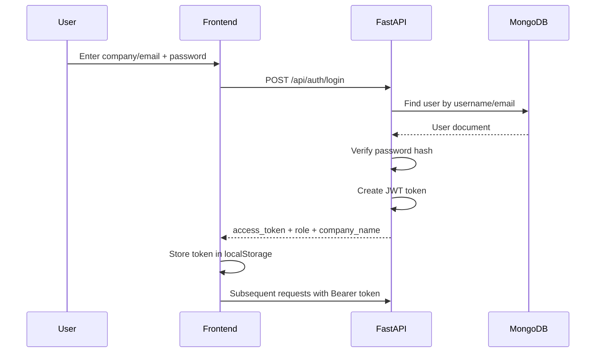
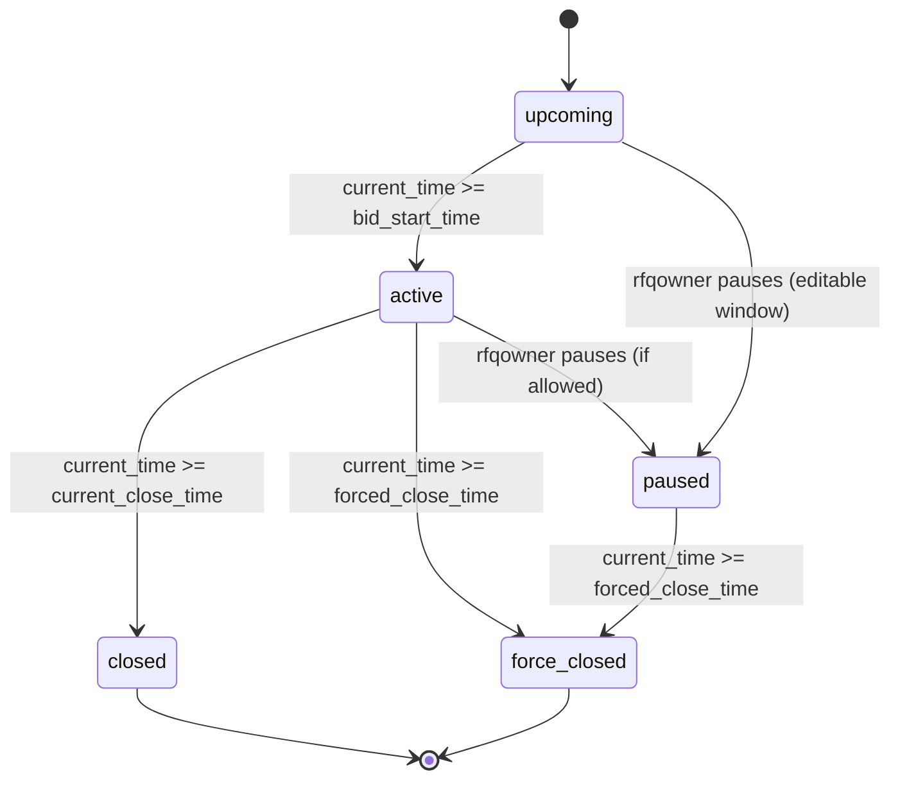
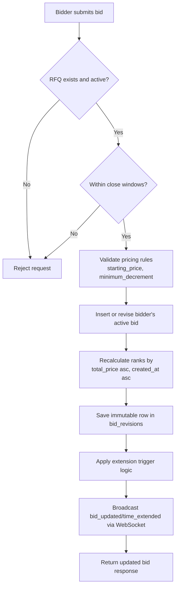
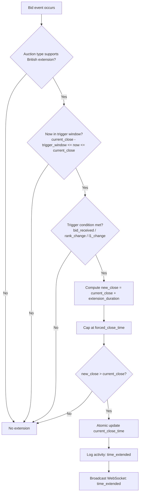
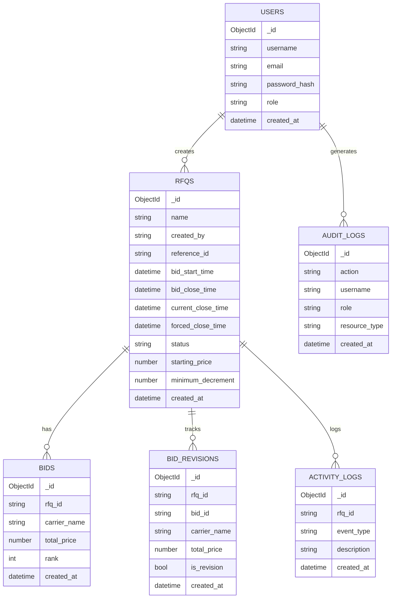
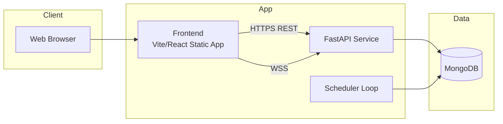

# BidForge - Complete Application Documentation

Use this as the single source of truth for your project write-up.  
All Mermaid blocks below are ready to paste into Mermaid Live Editor or Markdown renderers that support Mermaid.

---

## 1) Project Overview

### 1.1 Problem Statement

<!-- Write what procurement/logistics problem BidForge solves -->

### 1.2 Solution Summary

<!-- Write what your app does in 4-6 points -->

### 1.3 Key Features

- Role-based authentication (`rfqowner`, `bidder`)
- RFQ creation and auction lifecycle management
- Real-time bidding with WebSocket updates
- British-auction style extension logic
- Activity timeline, exports, metrics, and winner award

---

## 2) System Architecture Diagram

```mermaid
flowchart LR
    U[Users]
    B1[RFQ Owner]
    B2[Bidder]
    FE[Frontend<br/>React + Vite + MUI]
    API[Backend API<br/>FastAPI]
    WS[WebSocket Room Manager]
    SCH[Auction Scheduler]
    DB[(MongoDB)]
    AI[Gemini API<br/>Recommendations]

    U --> B1
    U --> B2
    B1 --> FE
    B2 --> FE
    FE -->|REST /api/*| API
    FE -->|WS /api/ws/rfqs/{id}| WS
    API --> DB
    SCH --> DB
    SCH --> WS
    API -->|optional| AI
```

---

## 3) Authentication Flow (Sequence Diagram)



---

## 4) RFQ Lifecycle State Diagram



---

## 5) Bid Submission and Ranking Flow



---

## 6) Auction Extension Decision Flow



---

## 7) Data Model (ER Diagram)



---

## 8) Deployment Diagram



---

## 9) API Surface

### 9.1 Auth

- `POST /api/auth/signup`
- `POST /api/auth/login`
- `GET /api/auth/me`
- `GET /api/auth/settings`
- `PATCH /api/auth/settings`

### 9.2 RFQ and Auction

- `POST /api/rfqs`
- `GET /api/rfqs`
- `GET /api/rfqs/{rfq_id}`
- `PATCH /api/rfqs/{rfq_id}`
- `DELETE /api/rfqs/{rfq_id}`
- `POST /api/rfqs/{rfq_id}/pause`
- `POST /api/rfqs/{rfq_id}/award`
- `GET /api/bidder/my-auctions`

### 9.3 Bids and Activity

- `POST /api/rfqs/{rfq_id}/bids`
- `GET /api/rfqs/{rfq_id}/bids`
- `GET /api/rfqs/{rfq_id}/bids/export`
- `GET /api/rfqs/{rfq_id}/bid-revisions`
- `GET /api/rfqs/{rfq_id}/activity`
- `GET /api/rfqs/{rfq_id}/activity/export`

### 9.4 Metrics

- `GET /api/metrics/bids-per-rfq`
- `GET /api/metrics/avg-bids`
- `GET /api/metrics/winning-price-trend`
- `GET /api/metrics/extensions-per-rfq`
- `GET /api/metrics/extension-impact`
- `POST /api/dashboard/recommendations`

---

## 10) Business Rules

- `forced_close_time` must be greater than `bid_close_time`.
- Bidding allowed only while auction is active.
- One active bid row per bidder per RFQ (revisions update existing row).
- Rank is recalculated globally for RFQ after every submit/revision.
- Auto-extension applies only for British-compatible auction types.
- Extension never exceeds `forced_close_time`.
- Winner can be awarded only after `closed` or `force_closed`.

---

## 11) Security and Reliability

- JWT authentication + role-based authorization.
- Password hashing with PBKDF2-SHA256 (legacy bcrypt verification support).
- In-memory request rate limiting.
- Request ID propagation (`x-request-id`).
- HTTPS enforcement + HSTS in production.
- Scheduler runs periodic status sync and websocket status push.
- Audit logs for sensitive actions.

---

## 12) Testing Strategy

### 12.1 Backend

<!-- Mention pytest coverage: auth, auction logic, route hardening, websocket auth -->

### 12.2 Frontend

<!-- Mention page-level and auth flow tests -->

### 12.3 Manual Test Checklist

- Signup/login both roles
- Create RFQ with valid/invalid times
- Submit bids and verify rank updates
- Trigger extension near close time
- Verify pause/award/export flows

---

## 13) Future Enhancements

- Redis-based distributed rate limiter and WebSocket pub/sub.
- Notifications (email/WhatsApp/Slack) for close/award events.
- Rich attachment storage with signed URLs.
- Multi-tenant organization boundaries and fine-grained permissions.
- Advanced bidder analytics and recommendation explainability.

---

## 14) Appendix

### 14.1 Environment Variables

<!-- Copy final env keys used in backend/.env and frontend/.env -->

### 14.2 Demo Credentials

<!-- Add seed_demo and/or seed_full credentials -->

### 14.3 Links

<!-- Add deployed app URL, API docs URL, repo URL -->
