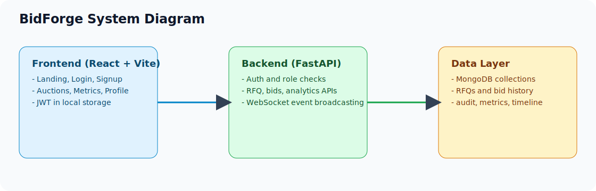

# BidForge High-Level Design (HLD)

## 1) Purpose and Scope

BidForge is a role-based RFQ auction platform for logistics procurement. It supports:

- `rfqowner` workflows to create/manage RFQs, monitor bidding, award winners, and analyze outcomes.
- `bidder` workflows to submit/revise bids during active windows and track personal competitiveness.
- British-style auto-extension logic for compatible auction types.
- Operational transparency through activity timelines, bid revisions, exports, and audit trails.

This document reflects the current implementation in `backend/` and `frontend/`.

## 2) Personas and Core Journeys

### Personas

- `rfqowner`
  - Creates and configures RFQs.
  - Controls pre-bid changes and pause action (with constraints).
  - Reviews bids, activity, analytics, and awards a winner post-close.
- `bidder`
  - Discovers available RFQs.
  - Places or revises one bid per RFQ (upsert behavior).
  - Receives live rank/timing updates via WebSocket.

### Core Journeys

1. Authentication via signup/login using JWT bearer tokens.
2. RFQ lifecycle setup with time windows, pricing controls, and extension strategy.
3. Real-time bidding with rank recalculation and optional auto-extension.
4. Automatic status transitions (`upcoming` -> `active` -> `closed`/`force_closed`) through scheduler + runtime evaluation.
5. Outcome workflows: winner award, CSV exports, dashboard metrics, auditability.

## 3) System Architecture

BidForge uses a 3-tier architecture.

### Frontend Layer (React + Vite + MUI)

- SPA routes in `frontend/src/App.jsx`.
- Role-aware navigation:
  - `rfqowner`: Dashboard, Auctions, Create RFQ, Metrics, Profile.
  - `bidder`: Dashboard, Auctions, My bids, Profile.
- API client in `frontend/src/api.js`:
  - Axios with auth interceptor (`Authorization: Bearer <token>`).
  - Default local/prod API and WebSocket base URL support.

### Backend Layer (FastAPI)

- API entrypoint in `backend/main.py`.
- Domain endpoints in `backend/routes.py`:
  - RFQ CRUD/lifecycle actions.
  - Bid submit/list/export and revision feed.
  - Activity list/export.
  - Metrics pipelines.
  - WebSocket endpoint per RFQ room.
- Auth in `backend/auth.py` + `backend/auth_routes.py`:
  - Signup/login/profile/settings.
  - JWT validation + role authorization.
  - Password hashing via PBKDF2-SHA256 (with legacy bcrypt verify compatibility).

### Data Layer (MongoDB via Motor)

- Collections managed in `backend/database.py`.
- Indexed collections for RFQs, bids, revisions, activity logs, users, and audit logs.
- Aggregation-heavy reads for list/detail and metrics to avoid N+1 query patterns.

## 4) Runtime Components and Responsibilities

### API and Middleware

- `RequestIDMiddleware`: propagates request correlation ID via `x-request-id`.
- `HttpsEnforcementMiddleware`: HTTPS redirect + HSTS in production.
- `InMemoryRateLimiter`:
  - Global per-host-method-path throttle.
  - Tighter per-minute throttle for `POST /api/rfqs/{id}/bids`.
- CORS with explicit origins and optional regex override.

### Auction Status Engine

Status is computed from clock + RFQ fields:

- `upcoming`: now < `bid_start_time`
- `active`: between start and current close (and before forced close)
- `paused`: `is_paused` is true and forced close not reached
- `closed`: now >= `current_close_time` (but < forced close)
- `force_closed`: now >= `forced_close_time`

Implementation details:

- Read APIs compute live status without mutating DB.
- Scheduler (`backend/scheduler.py`) updates persisted status every 5s for active set and emits websocket `status_changed`.
- Distributed lock support (`scheduler_lock`) prevents multi-instance scheduler contention.

### British Auction Extension Engine

Extension behavior (only for British-style auction types):

- Gated by `auction_type` through `is_british_style_auction()` in `backend/auction_constants.py`.
- Evaluated only when a bid event occurs and only if current time lies in trigger window:
  - Window = `[current_close_time - trigger_window_minutes, current_close_time]`
- Extension amount = `extension_duration_minutes`.
- Hard cap = `forced_close_time`.
- Atomic compare-and-set on `current_close_time` prevents concurrent double extension.
- Emits:
  - `activity_logs` event `time_extended`
  - WebSocket message `time_extended`

Supported extension trigger policies per RFQ:

- `bid_received`
- `rank_change`
- `l1_change`

### Bid Engine

- One active bid per `(rfq_id, bidder)` (unique index + upsert-like flow).
- Bid submit path:
  1. Validate RFQ exists and is active.
  2. Validate close windows.
  3. Validate pricing rules:
     - First bid must be <= `starting_price`.
     - Subsequent bids must beat current L1 by at least `minimum_decrement` (if configured).
  4. Insert/update bid.
  5. Recalculate all ranks by `(total_price ASC, created_at ASC)`.
  6. Insert immutable revision entry into `bid_revisions`.
  7. Apply extension logic if configured and eligible.
  8. Broadcast websocket `bid_updated`.

## 5) API Surface (High-Level)

### Authentication

- `POST /api/auth/signup`
- `POST /api/auth/login`
- `GET /api/auth/me`
- `GET /api/auth/settings`
- `PATCH /api/auth/settings`

### RFQ and Auction Management

- `POST /api/rfqs`
- `GET /api/rfqs`
- `GET /api/rfqs/{rfq_id}`
- `PATCH /api/rfqs/{rfq_id}`
- `DELETE /api/rfqs/{rfq_id}`
- `POST /api/rfqs/{rfq_id}/pause`
- `POST /api/rfqs/{rfq_id}/award`
- `GET /api/bidder/my-auctions`

### Bids and Activity

- `POST /api/rfqs/{rfq_id}/bids`
- `GET /api/rfqs/{rfq_id}/bids`
- `GET /api/rfqs/{rfq_id}/bids/export`
- `GET /api/rfqs/{rfq_id}/bid-revisions`
- `GET /api/rfqs/{rfq_id}/activity`
- `GET /api/rfqs/{rfq_id}/activity/export`

### Metrics and Recommendations

- `GET /api/metrics/bids-per-rfq`
- `GET /api/metrics/avg-bids`
- `GET /api/metrics/winning-price-trend`
- `GET /api/metrics/extensions-per-rfq`
- `GET /api/metrics/extension-impact`
- `POST /api/dashboard/recommendations` (Gemini-backed with deterministic fallback)

### Realtime

- `WS /api/ws/rfqs/{rfq_id}`
  - Auth token passed via websocket subprotocol: `["token", "<jwt>"]`

## 6) Data and Integration Boundaries

- Primary database: MongoDB.
- No external queue is currently required.
- Optional AI integration: Google Gemini API for dashboard recommendations.
- Frontend and backend are independently deployable; communication over REST + WebSocket.

## 7) Security and Compliance Controls

- JWT auth with role-based route guards.
- Password hashing using PBKDF2-SHA256 with per-password random salt.
- Legacy bcrypt verification retained for backward compatibility.
- Request-level and endpoint-sensitive rate limiting.
- CORS restrictions and optional origin regex.
- HTTPS enforcement in production and HSTS response header.
- Structured audit logging for auth, RFQ, bid, metrics, and export actions.

## 8) Performance and Scalability Notes

- Indexed read patterns across `rfqs`, `bids`, `activity_logs`, `users`, `audit_logs`.
- Aggregation pipelines for listing and analytics reduce application-level joins.
- Rank recalculation is RFQ-scoped and deterministic.
- WebSocket manager is in-memory (single process); horizontal scaling would require shared pub/sub for broadcast fan-out.

## 9) Known Design Constraints

- In-memory rate limiter and websocket room state are process-local.
- Scheduler loop interval is fixed at 5 seconds.
- MongoDB referential integrity is application-managed (no native foreign keys).
- Unknown custom auction types do not auto-extend by design.

## 10) Diagrams

