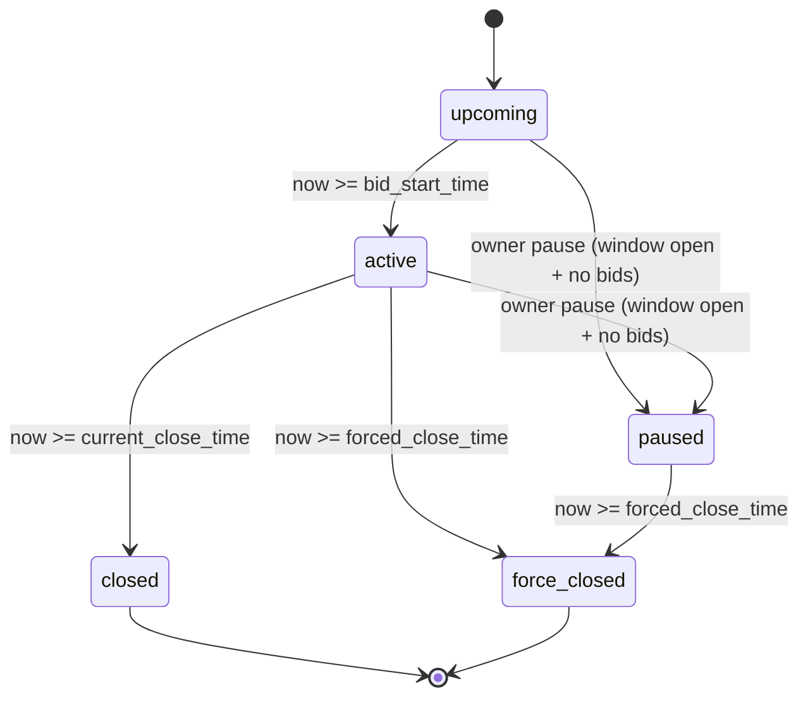

# BidForge - British Auction RFQ System

BidForge is a full-stack RFQ and reverse-auction platform for logistics procurement. It provides role-based workflows for `rfqowner` and `bidder` users, real-time bidding, auto-extension logic, winner award, analytics, and operational auditability.

## What BidForge Supports

- Authentication and authorization (`rfqowner`, `bidder`) using JWT bearer tokens.
- RFQ creation with rich auction configuration:
  - Time windows (`bid_start_time`, `bid_close_time`, `forced_close_time`)
  - Extension strategy (`trigger_window_minutes`, `extension_duration_minutes`, `extension_trigger`)
  - Pricing guards (`starting_price`, `minimum_decrement`)
  - Visibility mode (`full_rank`, `masked_competitor`)
- Bidding with one active bid per bidder per RFQ (revisions overwrite active row and also create immutable revision history).
- Deterministic rank calculation by lowest total bid, tie-broken by earliest timestamp.
- Auto-extension for British-style auctions only.
- Real-time updates over WebSocket (`status_changed`, `bid_updated`, `time_extended`).
- Activity timeline and CSV exports (bids and activity).
- RFQ award workflow after close/force-close.
- Metrics dashboards and optional AI recommendations.

## User Journeys (Current App)

### RFQ Owner journey

1. Login/signup as `rfqowner`.
2. Use `Dashboard` for portfolio-level insights and recommendations.
3. Use `Auctions` page to search/filter/sort RFQs and monitor countdowns.
4. Create RFQ from `Create RFQ` with:
   - timeline fields,
   - extension trigger configuration,
   - pricing guards (`starting_price`, `minimum_decrement`),
   - optional technical spec metadata.
5. Open `Auction Detail` to:
   - monitor live bids/activity,
   - edit/pause (when permitted),
   - export bids/timeline CSV,
   - award winner after closure.
6. Use `Success Metrics` page for bids trend, winning-price trend, extension frequency, and extension impact.

### Bidder (Supplier) journey

1. Login/signup as `bidder`.
2. Use bidder `Dashboard` for participation, rank health, and risk insights.
3. Browse `Auctions` and open relevant RFQ.
4. Submit or revise bid in `Auction Detail`.
5. Receive real-time updates (`bid_updated`, `time_extended`, `status_changed`).
6. Use `My bids` page for a focused view of own rank, price, and close countdown.

## Tech Stack

### Backend

- FastAPI
- Motor (MongoDB async driver)
- Pydantic
- python-jose (JWT)
- passlib + PBKDF2/bcrypt compatibility
- httpx

### Frontend

- React
- Vite
- MUI
- React Router
- Recharts
- Axios

### Data

- MongoDB

## Architecture Diagram (Current)

```mermaid
flowchart LR
    subgraph Client
      O[RFQ Owner]
      B[Bidder]
      FE[React + Vite + MUI]
    end

    subgraph Backend
      API[FastAPI Routes]
      AUTH[JWT + RBAC]
      RATE[Rate Limiter]
      WS[WebSocket Manager]
      SCH[Status Scheduler]
    end

    DB[(MongoDB)]
    AI[Gemini Optional]

    O --> FE
    B --> FE
    FE -->|REST /api/*| API
    FE -->|WS /api/ws/rfqs/{id}| WS
    API --> AUTH
    API --> RATE
    API --> DB
    SCH --> DB
    SCH --> WS
    API --> AI
```

## Auction Lifecycle Diagram



## Repository Layout

- `backend/`
  - API (`main.py`, `routes.py`, `auth_routes.py`)
  - auth/security (`auth.py`, `rate_limit.py`, `audit.py`)
  - background status scheduler (`scheduler.py`)
  - data access and indexes (`database.py`)
  - metrics pipelines (`metrics_pipeline.py`)
  - tests and seed scripts
- `frontend/`
  - app shell and routes (`src/App.jsx`)
  - pages for dashboard, auctions, create RFQ, detail, metrics, profile, auth
  - API client (`src/api.js`)
  - assets and diagrams

## Local Setup

## Prerequisites

- Python 3.10+ recommended
- Node.js 18+ recommended
- MongoDB running locally or on Atlas

## 1) Backend configuration

Copy and edit:

```bash
cp backend/.env.example backend/.env
```

Set at least:

```env
MONGODB_URL=mongodb://127.0.0.1:27017
DATABASE_NAME=british_auction_rfq
JWT_SECRET=your-long-random-secret
APP_ENV=development
CORS_ORIGINS=http://localhost:5173,http://localhost:3000
RATE_LIMIT_PER_MINUTE=120
RATE_LIMIT_BID_SUBMIT_PER_MINUTE=10
GEMINI_API_KEY=
GEMINI_MODEL=gemini-2.5-flash
```

Important: backend startup fails if `JWT_SECRET` is missing or still insecure/default.

## 2) Frontend configuration

Create `frontend/.env`:

```env
VITE_API_BASE_URL=http://localhost:8000/api
VITE_WS_BASE_URL=ws://localhost:8000
```

If omitted, frontend uses built-in local/prod defaults from `frontend/src/api.js`.

## 3) Run backend

```bash
cd backend
python -m venv .venv
source .venv/bin/activate
pip install -r requirements.txt
uvicorn main:app --reload --port 8000
```

Backend URLs:

- API root: `http://localhost:8000/`
- OpenAPI docs: `http://localhost:8000/docs`

## 4) Run frontend

```bash
cd frontend
npm install
npm run dev
```

Frontend URL: `http://localhost:5173`

## Seed Data

### Quick demo seed

```bash
cd backend
python seed_demo.py
```

Creates:

- `demo_rfqowner / demo123`
- `demo_bidder_a / demo123`
- `demo_bidder_b / demo123`

### Full scenario seed

```bash
cd backend
python seed_full.py
```

Creates a full mock dataset with multiple RFQ states (`upcoming`, `active`, `paused`, `closed`, `force_closed`), extension scenarios, and winner-awarded examples.

## Running Tests

### Backend

```bash
cd backend
pytest
```

### Frontend

```bash
cd frontend
npm run test
npm run lint
npm run build
```

## Auction Rules (Implemented Behavior)

- `forced_close_time` must be later than `bid_close_time`.
- `current_close_time` starts as `bid_close_time`.
- Bidding is rejected when current close or forced close is reached.
- Extension checks occur only inside trigger window before current close.
- Extension duration is capped by forced close.
- Extension can be triggered by:
  - `bid_received`
  - `rank_change`
  - `l1_change`
- Extension logic runs only for British-style auction types (e.g. `Reverse Auction (lowest wins)`), not sealed/fixed types.

## Visibility Rules (Owner vs Bidder)

- RFQ Owner can see all bid commercial details.
- In `masked_competitor` mode, owner-side bidder identities are alias-masked (`Bidder 1`, `Bidder 2`, ...).
- Bidder sees full details only for self; competitor commercial values are hidden/redacted.

## Security and Reliability Highlights

- JWT auth with role-based access guards.
- Password hashing with PBKDF2-SHA256 (legacy bcrypt verify support).
- In-memory rate limiting (global + bid-submit specific).
- Request ID propagation via `x-request-id`.
- HTTPS redirect + HSTS in production mode.
- Audit logs for auth/RFQ/bid/metrics/export operations.
- Scheduler loop updates persisted statuses every 5 seconds and broadcasts changes.

## API Overview

### Auth

- `POST /api/auth/signup`
- `POST /api/auth/login`
- `GET /api/auth/me`
- `GET /api/auth/settings`
- `PATCH /api/auth/settings`

### RFQ and Auction

- `POST /api/rfqs`
- `GET /api/rfqs`
- `GET /api/rfqs/{rfq_id}`
- `PATCH /api/rfqs/{rfq_id}`
- `DELETE /api/rfqs/{rfq_id}`
- `POST /api/rfqs/{rfq_id}/pause`
- `POST /api/rfqs/{rfq_id}/award`
- `GET /api/bidder/my-auctions`

### Bids and Activity

- `POST /api/rfqs/{rfq_id}/bids`
- `GET /api/rfqs/{rfq_id}/bids`
- `GET /api/rfqs/{rfq_id}/bids/export`
- `GET /api/rfqs/{rfq_id}/bid-revisions`
- `GET /api/rfqs/{rfq_id}/activity`
- `GET /api/rfqs/{rfq_id}/activity/export`

### Metrics and Dashboard

- `GET /api/metrics/bids-per-rfq`
- `GET /api/metrics/avg-bids?period=day|week|month`
- `GET /api/metrics/winning-price-trend?period=day|week|month`
- `GET /api/metrics/extensions-per-rfq`
- `GET /api/metrics/extension-impact?period=day|week|month`
- `POST /api/dashboard/recommendations`

### WebSocket

- `WS /api/ws/rfqs/{rfq_id}`
- Client must pass JWT as subprotocol: `["token", "<jwt>"]`

## Pagination Contract

Paginated endpoints generally support:

- `page` (default `1`)
- `page_size` (typically default `20`; endpoint-specific max applies)

Response shape:

- `items`
- `total`
- `page`
- `page_size`
- `has_next`

## Product Assets

- Logo: `frontend/src/assets/bidforge-logo.svg`
- Architecture diagram: `frontend/src/assets/diagram-system.svg`
- Auction flow diagram: `frontend/src/assets/diagram-flow.svg`

## Notes for Production Deployment

- Use a strong `JWT_SECRET` and secure Mongo credentials.
- Restrict CORS origins to exact domains.
- Provide TLS termination and run with `APP_ENV=production`.
- Replace in-memory rate limiter/websocket manager with distributed alternatives if scaling to multiple backend instances.
